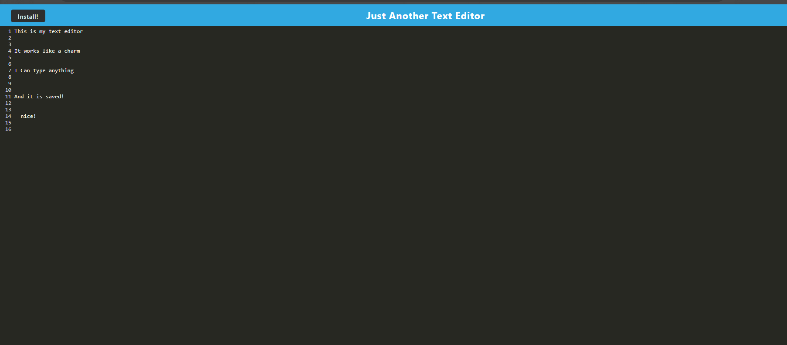

# Text Editor 

## User Story
AS A developer 
I WANT to create notes or code snippets with or without an internet connection 
SO THAT I can reliably retrieve them for later use 

## Installation

Simply click on the associated Heroku app, and click either the install button on the app, or in the install button in the window. 

## Screenshot

## Links
Github: https://github.com/Cuttingham/text-editor 
Heroku: https://desolate-ravine-46474.herokuapp.com/